# diy-alarm-clock
[](https://travis-ci.org/richardregeer/diy-alarm-clock)

This a do it yourself alarm clock bases on the Arduino platform.

# Software installation
To develop use the [Arduino IDE](https://www.arduino.cc/en/Main/Software) or use PlatformIO for [Atom](https://atom.io/packages/platformio-ide-terminal) or [VSCode](https://docs.platformio.org/en/latest/ide/vscode.html).

To be able to run and compile the code via CLI:
```bash
pip install platformio
```
To install all depencies and run the code on an Arduino
```bash
platformio run
```

# Used components

## Electronic components
- Arduino Uno
- Arduino Prototype shield
- [Adafruit RTC](https://www.adafruit.com/product/3296)
- [Adafruit 7 segment display](https://learn.adafruit.com/adafruit-led-backpack/0-dot-56-seven-segment-backpack)
- [2 diffused 5MM Neopixel RGB LED's](https://www.adafruit.com/product/1938)
- [DFPlayer Mp3 player with a microSD card](https://www.dfrobot.com/wiki/index.php/DFPlayer_Mini_SKU:DFR0299)
- 6(1 red, 3 yellow, 2 green) [LED 16mm momentary push buttons](https://www.adafruit.com/product/1439)
- 28mm 8ohm 0.5w [speaker](https://www.kiwi-electronics.nl/mini-metal-speaker-with-wires-8-ohm-0-5w?search=Kleine%20Metalen%20Speaker%20met%20Draadjes%20-%208%20ohm%200.5W%20&description=true)

## Casing
- MDF wood
- Printed image with plastic protection cover

## Additinal material
- Wire
- Screws
- Solder
- Resistors

## Pin schema
| Pin nr | Component         |
| -------|:-----------------:|
| 2      | Yellow button 1   |
| 3      | Yellow button 2   | 
| 4      | Yellow button 3   |
| 5      | Red button        |
| 6      | Red button LED    |
| 7      | RGB LEDS          |
| 8      | Green button 1    |
| 9      | Green button 2    |
| 10     | MP3               |
| 11     | MP3               |
| 12     | Green button LEDs |
| 13     | Yellow button LEDs|

>Pin 13 uses the resistor of the arduino

<!-- 

 -->

# Projects I have build
## Woezel and pip
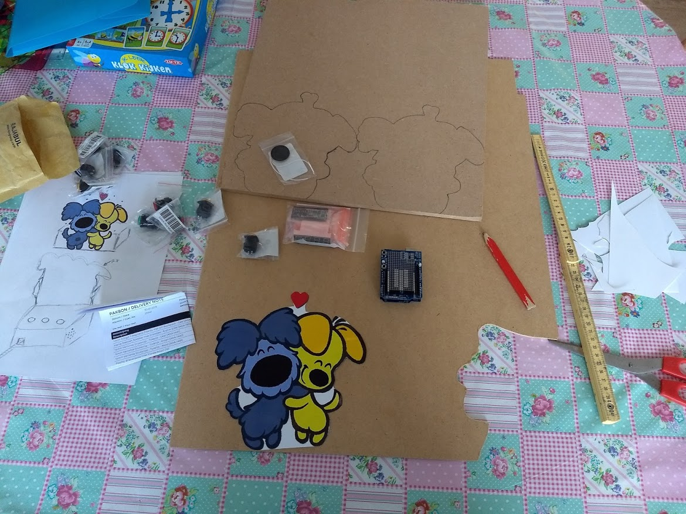
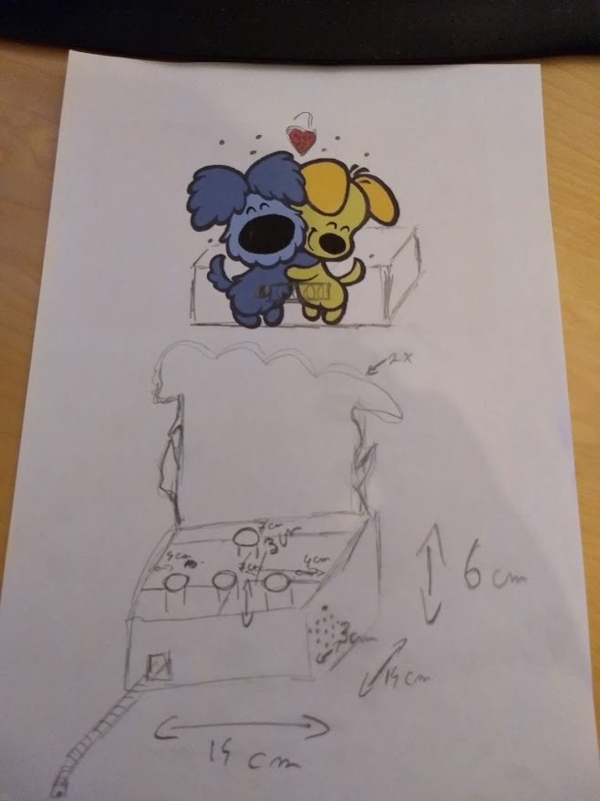
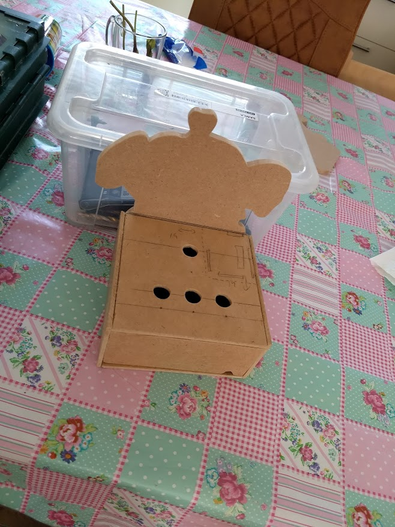
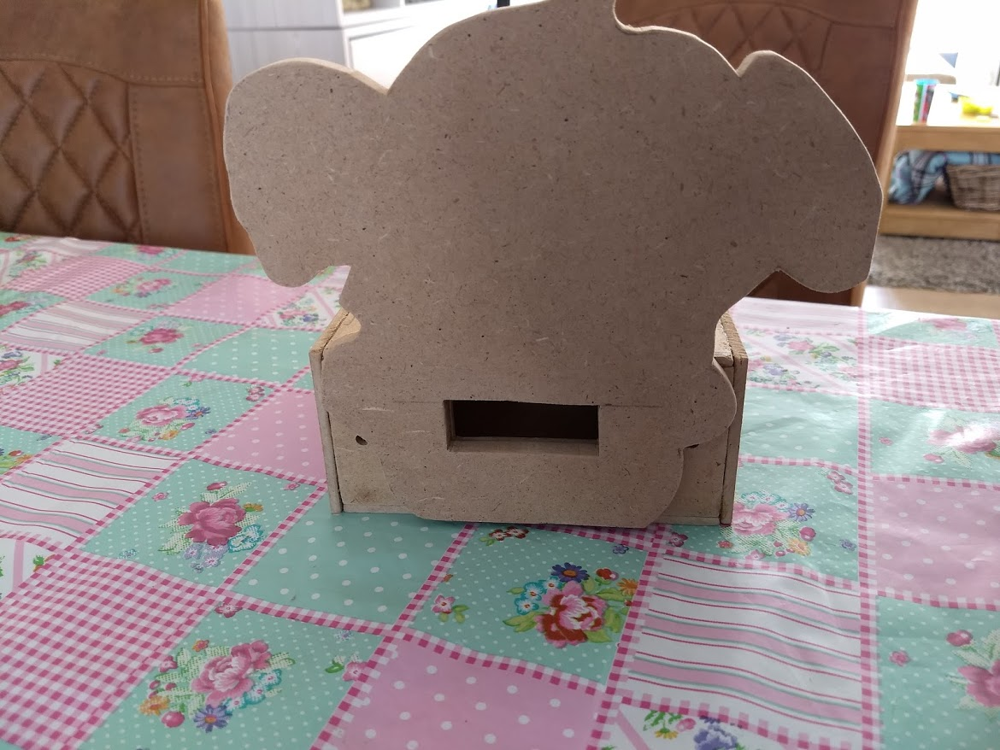
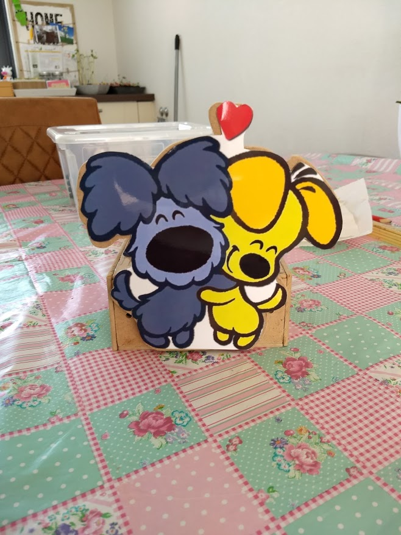
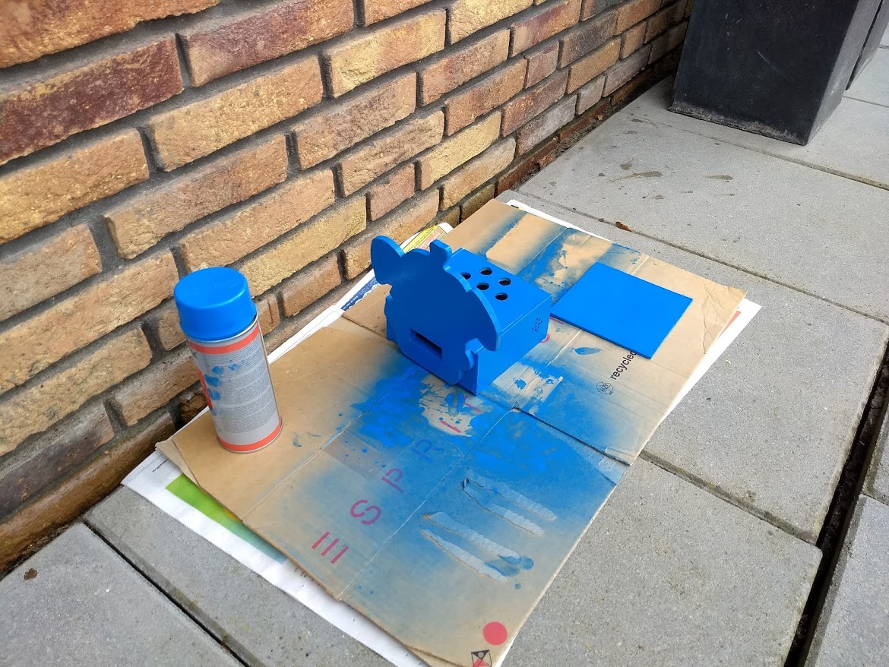
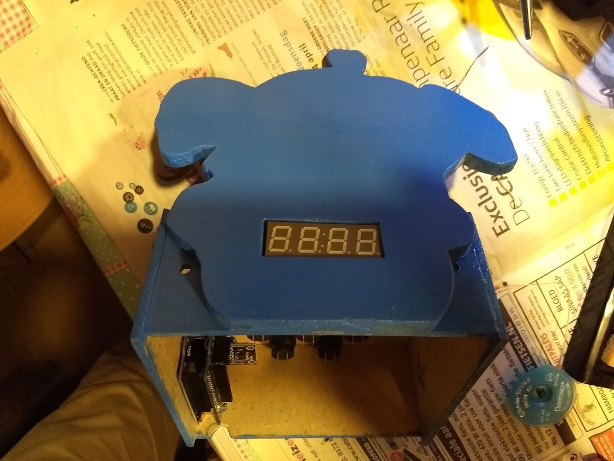
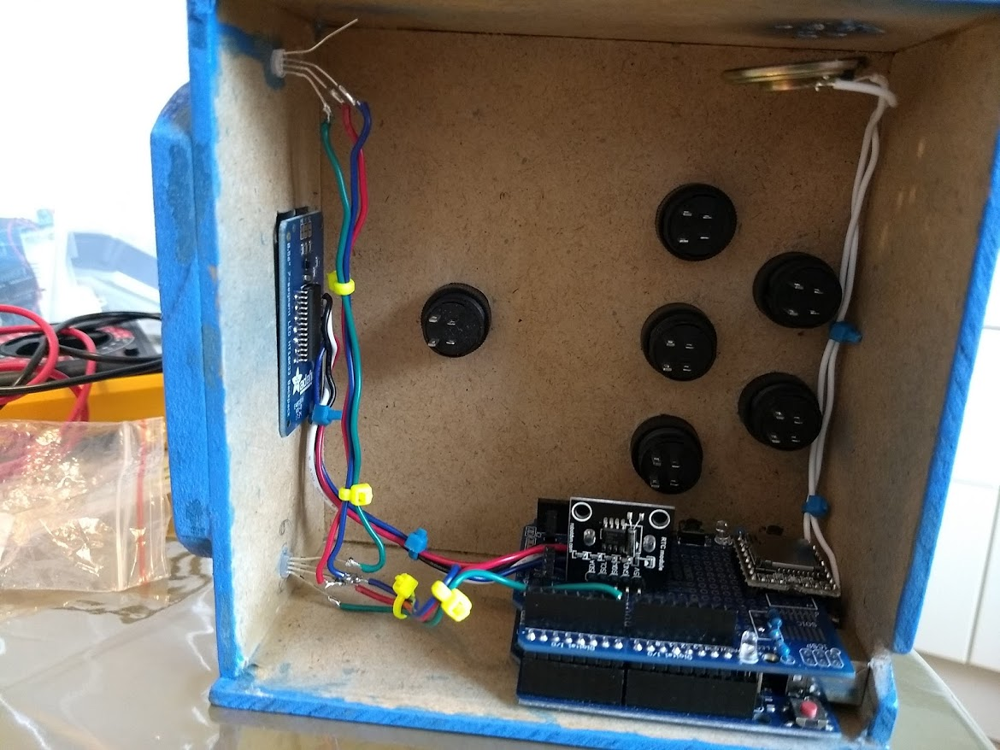
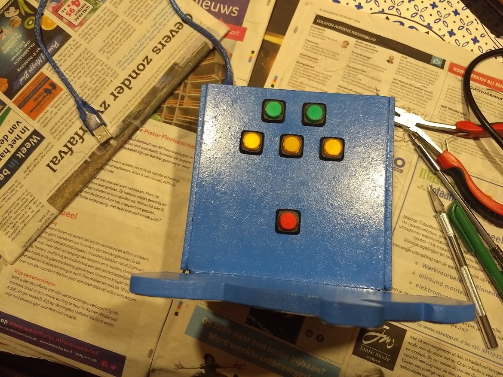

## Rescue bots
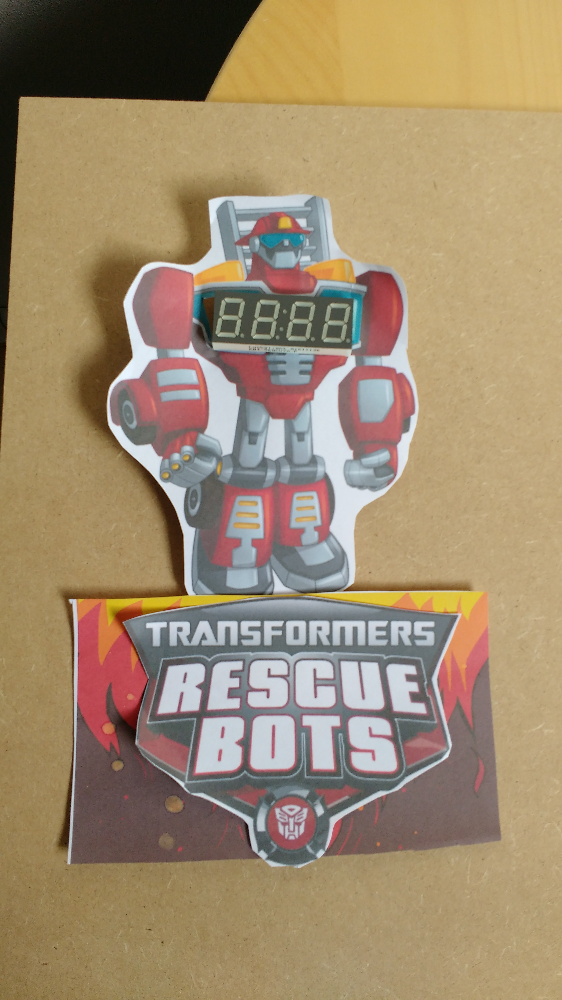
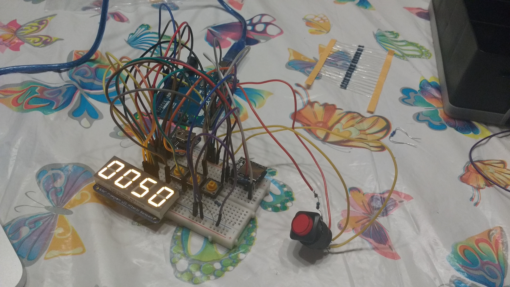
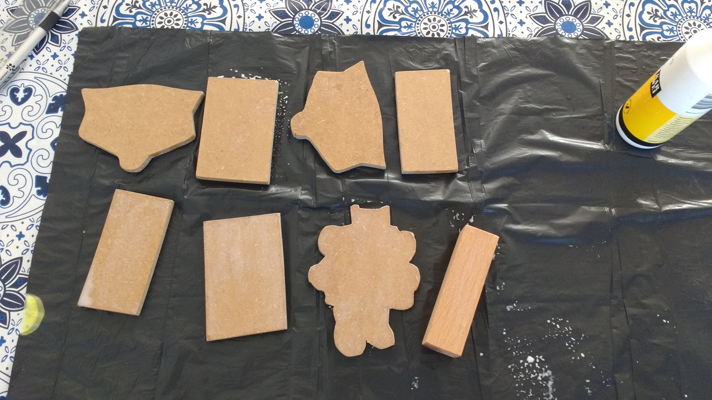
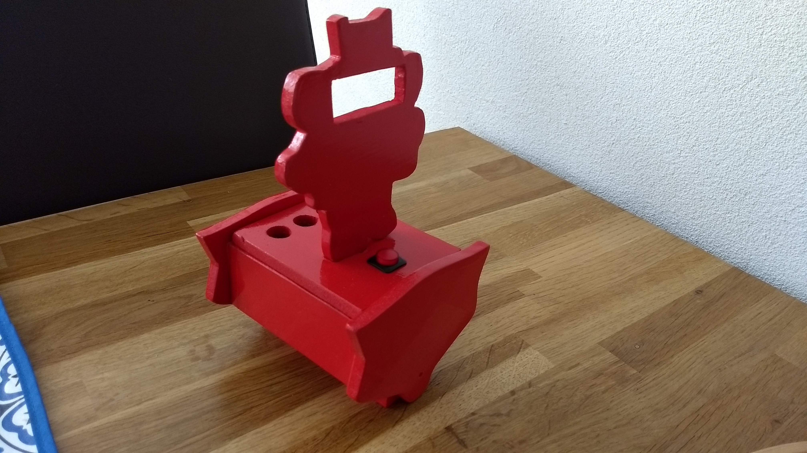
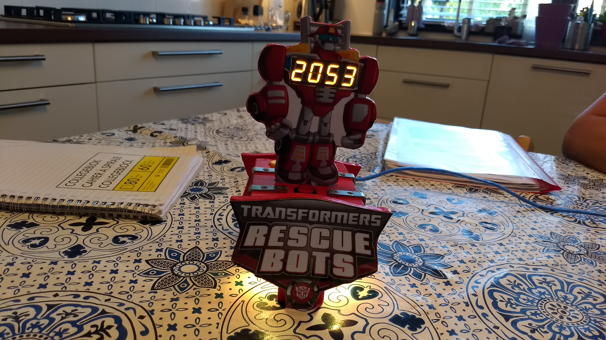
